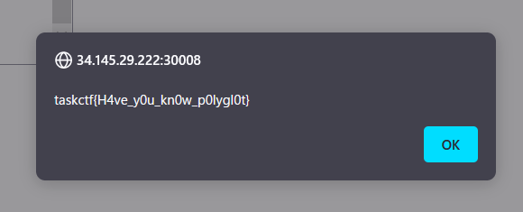

# polygolf:Misc:50pts
同一のコードで複数のプログラミング言語やファイル形式に対応するものをPolyglotと呼びます。 また、与えられたアルゴリズムを可能な限り短く書く競技のことをコードゴルフと呼びます。  
この2つを合わせた、文字数制限付きのPolyglotを用意してみました。  
[http://34.145.29.222:30008](http://34.145.29.222:30008/)  
[dist.zip](dist.zip)  

# Solution
URLにアクセスするとPolyglotの強化版のようで、185バイトの制限がかかっている。
Polygolf  
[site.png](site/site.png)  
先ほどの各言語ごとのコードを短くしなければならない。  
Cはかなり自由が利きそうなので、まずはGoのコードについて考える。  
ファイルを開いて出力するよりも、OSコマンドを実行するほうが短くて済みそうなのでそちらを採用する  
```go
//\
/*
#if 0
//*/
package main
import(."fmt"
."os/exec")
func main(){
o,_:=Command("cat","flag").Output()
Print(string(o))}
//\
/*
#endif
//*/
```
かなり短くなった。  
Cはsystemをするだけなので問題はない。  
```c
//\
/*
main(){system("cat flag");}
#if 0
//*/
package main
import(."fmt"
."os/exec")
func main(){
o,_:=Command("cat","flag").Output()
Print(string(o))}
//\
/*
#endif
//*/
```
完成したものを送信するとflagが得られた。  
  

## taskctf{H4ve_y0u_kn0w_p0lygl0t}